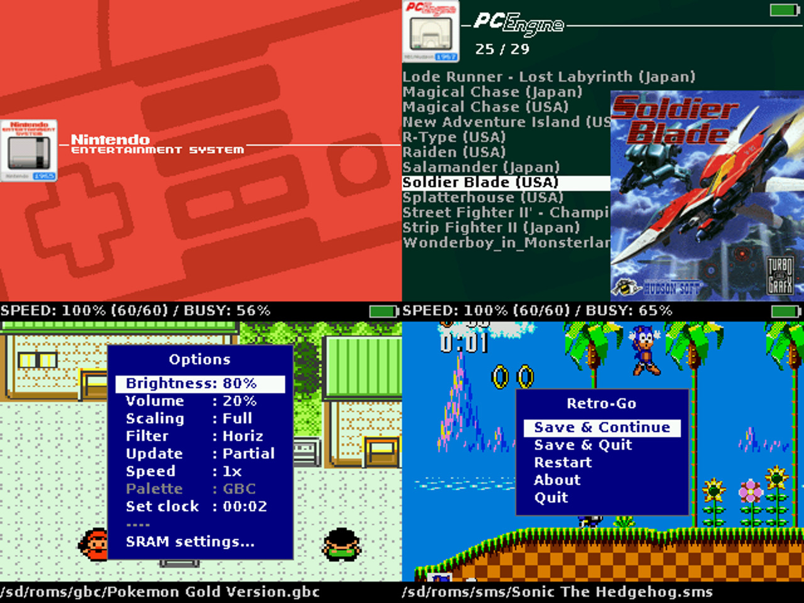

# Table of contents
- [中文说明（小猫移植版）](#中文说明小猫移植版)
- [中文文档导航](#中文文档导航)
- [小猫移植到其他 ESP32 项目](#小猫移植到其他-esp32-项目)
- [Description](#description)
- [Installation](#installation)
- [Usage](#usage)
- [Issues](#issues)
- [Development](#development)
- [Acknowledgements](#acknowledgements)
- [License](#license)

# 中文说明（小猫移植版）

本仓库是在 Retro-Go 基础上为**学而思小猫（XIAOMIAO）ESP32 掌机**制作的移植版本。当前分支已经针对
2.4 英寸 ST7789 屏幕、中文菜单、MAX98357A 外部音频和 GPIO14 背光已经完成配置，英文原版说明仍保留在本文档后半部分。

更详细的 GPIO、SPI/DMA、ST7789 初始化、SD 卡、按键、MAX98357A I2S 音频和 GPIO14 背光驱动说明见
[XIAOMIAO_HARDWARE_REFERENCE.md](XIAOMIAO_HARDWARE_REFERENCE.md)。

## 中文文档导航

| 文档 | 内容 |
|---|---|
| [XIAOMIAO_HARDWARE_REFERENCE.md](XIAOMIAO_HARDWARE_REFERENCE.md) | 当前小猫的 GPIO、ST7789、SPI/DMA、SD、按键、I2S 和背光驱动参考 |
| [XIAOMIAO_PORTING.md](XIAOMIAO_PORTING.md) | 将小猫适配移植到其他 ESP32 项目或复制为新 target 的中文步骤 |
| [BUILDING.md](BUILDING.md) | Retro-Go 通用构建、单独刷写和串口调试说明 |
| [PORTING.md](PORTING.md) | Retro-Go 通用 target 移植说明 |
| [LOCALIZATION.md](LOCALIZATION.md) | 新增中文菜单、翻译条目和字体的流程 |
| [THEMING.md](THEMING.md) | 默认主题图片、PNG 和 `tools/gen_images.py` 说明 |

## 小猫移植到其他 ESP32 项目

如果只是复用当前硬件驱动，重点参考 [XIAOMIAO_PORTING.md](XIAOMIAO_PORTING.md) 第 5 节：
先初始化 SPI2 和 ST7789，再使用 `0x2A → 0x2B → 0x2C` 写入 RGB565；音频使用 GPIO25/32/33 的 I2S，GPIO14 使用 LEDC 控制背光。

如果要在 Retro-Go 中新增一块板，请复制 `components/retro-go/targets/xiaomiao/`，修改 `config.h`、`env.py` 和 `sdkconfig`，
然后使用 `python rg_tool.py --target <target> build-img` 构建镜像。不要直接修改 `xiaomiao`，这样可以保留当前已验证的硬件配置作为参考。

## 当前固件默认配置

- **屏幕**：2.4 英寸 ST7789，面板原始分辨率 240×320，固件以横屏 320×240 使用。
- **画面方向**：已修正上下颠倒和左右镜像；如果更换屏幕排线或面板方向，需要重新调整
  `components/retro-go/targets/xiaomiao/config.h` 中的 `RG_SCREEN_ROTATION` 和 `RG_SCREEN_RGB_BGR`。
- **界面语言**：默认简体中文（`RG_LANG_DEFAULT RG_LANG_CN`）。没有翻译的新增字符串会回退到英文。
- **字体**：默认 Fusion Pixel 12（`RG_FONT_FUSIONPIXEL_12`），同时保留 ZenHei16 作为中文字体回退。
- **音频**：MAX98357A 通过 I2S 接收音频：LRC=GPIO32、BCLK=GPIO25、DIN=GPIO33。
- **背光**：GPIO14 通过 LEDC PWM 控制 LCD 背光；当前使用正常（非反相）PWM 极性。

## 10P 屏幕接线

下面是本移植版本使用的 14P 转 10P 接线。`NC` 表示悬空不接，LED 电源请确认屏幕模块的标注后再通电。

| 原 14P | 信号 | 新 10P | 说明 |
|---|---|---|---|
| 14P-2/5/13 | GND | 10P-1/10 | 地 |
| 14P-3 | LEDK | 10P-8 LED- | 背光负极 |
| 14P-4 | LEDA | 10P-9 LED+ | 背光正极 |
| 14P-6 | RESET | 10P-3 RST | 复位 |
| 14P-7 | DC | 10P-7 DC | 数据/命令 |
| 14P-8 | SDA | 10P-4 MOSI | SPI 数据 |
| 14P-9 | SCL | 10P-5 CLK | SPI 时钟 |
| 14P-10/11 | VCC/IOVCC | 10P-2 3.3V | 3.3 V 电源 |
| 14P-12 | CS | 10P-6 CS | SPI 片选 |
| 14P-1/14 | NC | 不接 | 悬空 |

对应的 ESP32 GPIO 为：`MOSI=23`、`CLK=18`、`CS=5`、`DC=4`。屏幕复位由驱动执行软件复位，
没有额外的 ESP32 GPIO；SD 卡片选为 `GPIO22`，不要与屏幕 CS 混接。

## 中文菜单、字体和翻译文件

中文支持由下面几部分组成：

1. `components/retro-go/translations.h`：菜单、提示和错误消息的简体中文翻译。
2. `components/retro-go/rg_localization.h`：注册 `RG_LANG_CN` 语言枚举。
3. `components/retro-go/fonts/FusionPixel12.c`：包含中文字符映射的主字体。
4. `components/retro-go/fonts/ZenHei16.c`：中文回退字体；英文字符缺失时会回退到基础 8×8 字体。
5. `components/retro-go/targets/xiaomiao/sdkconfig`：启用 `CONFIG_FATFS_API_ENCODING_UTF_8=y`，保证 SD 卡路径使用 UTF-8。

以上中文翻译和字体文件已经随本仓库提交，不需要另外下载语言包。由于中文字体占用的 Flash 空间较大，
XIAOMIAO 的 4 MB Flash 镜像已经接近容量上限，新增字体或资源前请先检查分区空间。

添加新的菜单文本时，请在 C 代码中使用 `_()` 包裹字符串，并同步在 `translations.h` 中补充
`RG_LANG_CN` 条目。修改字体后应重新生成对应的 C 字体文件，并确认字符映射和字形高度一致，
否则屏幕上可能出现点阵、缺字或整行被截断。

## 编译和刷写（Windows）

先在 ESP-IDF 环境中打开 PowerShell，然后在仓库根目录执行：

```powershell
# 构建完整的 XIAOMIAO 镜像
python rg_tool.py --target xiaomiao build-img

# 直接通过串口构建并刷写（把 COM8 改成实际端口）
python rg_tool.py --target xiaomiao --port COM8 install
```

### Windows 环境变量与一键刷写（小猫）

`rg_tool.py` 不是独立工具，必须在 ESP-IDF 环境中运行。直接执行 `python rg_tool.py` 如果看到 `IDF_PATH is not defined`，说明当前 PowerShell 没有加载 ESP-IDF。推荐使用仓库里的 `tools/flash_xiaomiao.ps1`，它会自动设置本机 ESP-IDF 5.3、Python、CMake、Ninja 和 Xtensa 工具链路径。

```powershell
# 自动配置环境、构建完整镜像并刷写 COM8
powershell -ExecutionPolicy Bypass -File .\tools\flash_xiaomiao.ps1 -Port COM8

# 首次替换固件：先备份完整 4MB Flash，再构建和刷写
powershell -ExecutionPolicy Bypass -File .\tools\flash_xiaomiao.ps1 -Port COM8 -BackupFirst

# 只刷 launcher，调试菜单和字体时更快
powershell -ExecutionPolicy Bypass -File .\tools\flash_xiaomiao.ps1 -Port COM8 -LauncherOnly
```

也可以双击项目根目录的 `一键刷机.cmd`。如果串口不是 COM8，请指定 `-Port COMx`。

如果需要手动执行，先设置 ESP-IDF 路径：

```powershell
$env:IDF_PATH = "$env:USERPROFILE\.platformio\packages\framework-espidf@3.50301.0"
$idfPython = "$env:USERPROFILE\.espressif\python_env\idf5.3_py3.12_env\Scripts\python.exe"
& $idfPython rg_tool.py --target xiaomiao --port COM8 install
```

命令行刷写 `.img` 时不要使用 `esptool.py` 或 `python esptool.py`；仓库中没有这个脚本文件。应使用 ESP-IDF Python 环境中的模块：

```powershell
& $idfPython -m esptool --chip esp32 --port COM8 --baud 921600 `
  write_flash --flash_size detect 0x0 retro-go_1.0-8-g2088e7b-dirty_xiaomiao.img
```


也可以使用生成的 `retro-go_*_xiaomiao.img`，通过网页 esptool 或命令行写入地址 `0x0`：

```powershell
python -m esptool --chip esp32 --port COM8 write_flash --flash_size detect 0x0 retro-go_<version>_xiaomiao.img
```

首次刷写后，请在 SD 卡根目录创建 `roms` 文件夹，并按模拟器名称放入 ROM，例如：

```text
/roms/nes/      *.nes、*.zip
/roms/gb/       *.gb、*.gbc、*.zip
/roms/snes/     *.smc、*.sfc、*.zip
```

旧版目录 `/sd/nes`、`/sd/gb` 等也会在标准目录为空时尝试扫描，但建议统一使用 `/sd/roms/<模拟器>`。

## 常见问题

- **中文变成很多点**：确认刷入的是包含 `FusionPixel12.c` 的完整镜像，并且 SD 卡文件名使用 UTF-8；不要只刷旧的英文镜像。
- **中文只显示半行**：检查屏幕是否为 320×240 横屏配置，并确认使用最新字体映射；不要把 CJK 字符按 8 像素 ASCII 宽度强制裁剪。
- **音频或背光异常**：确认 MAX98357A 的 LRC/BCLK/DIN 分别接 GPIO32/25/33，并确认 GPIO14 的背光接线和 PWM 极性正确。
- **扬声器没有声音**：确认 MAX98357A 的 VIN/GND 正确供电并与 ESP32 共地，LRC/BCLK/DIN 分别接 GPIO32/25/33；GPIO14 只用于背光，不再输出蜂鸣器音频。

# Description
Retro-Go is a firmware to play retro games on ESP32-based devices (officially supported are
ODROID-GO and MRGC-G32, check [this list for other devices](components/retro-go/README.md)).
The project consists of a launcher and half a dozen applications that have been heavily
optimized to reduce their cpu, memory, and flash needs without reducing compatibility!

### Supported systems:
- Nintendo: **NES, SNES (slow), Gameboy, Gameboy Color, Game & Watch**
- Sega: **SG-1000, Master System, Mega Drive / Genesis, Game Gear**
- Coleco: **Colecovision**
- NEC: **PC Engine**
- Atari: **Lynx**
- Others: **DOOM** (including mods!)

### Retro-Go features:
- In-game menu
- Favorites and recently played
- GB color palettes, RTC adjust and save
- NES color palettes, PAL roms, NSF support
- More emulators and applications
- Scaling and filtering options
- Better performance and compatibility
- Turbo Speed/Fast forward
- Customizable launcher
- Cover art and save state previews
- Multiple save slots per game
- Wifi file manager
- And more!

### Screenshots



# Installation

### ODROID-GO
  1. Download `retro-go_1.x_odroid-go.fw` from the [release page](https://github.com/ducalex/retro-go/releases/) and copy it to `/odroid/firmware` on your sdcard.
  2. Power up the device while holding down B.
  3. Select retro-go in the files list and flash it.

### MyRetroGameCase G32 (GBC)
  1. Download `retro-go_1.x_mrgc-g32.fw` from the [release page](https://github.com/ducalex/retro-go/releases/) and copy it to `/espgbc/firmware` on your sdcard.
  2. Power up the device while holding down MENU (the volume knob).
  3. Select retro-go in the files list and flash it.

### Other devices
  1. Download the .img for your device from the [release page](https://github.com/ducalex/retro-go/releases/).
  2. Connect your device to a computer with a USB cable.
  3. Flash the image with esptool:
     - [Command line](https://github.com/espressif/esptool/releases/): Run `python -m esptool write_flash --flash_size detect 0x0 retro-go_*.img`
     - [Web version](https://espressif.github.io/esptool-js/): Connect your device, click Erase Flash, then select your .img file and set address to 0x0, finally click Program)

Your particular device may require extra steps (like holding a button during power up) or different esptool flags or a special cable. If the above steps fail, you might need to ask the manufacturer for instructions on how to flash new firmware!

If your device is not already supported or if a prebuilt version isn't available for it you can check the [development section](#Development) for more information on how to build for your device.


# Usage

## Game covers / artwork
Game covers should be placed in the `romart` folder at the base of your sd card. You can obtain a pre-made pack [here](https://github.com/ducalex/retro-go-covers). Retro-Go is also compatible with the older Go-Play romart pack.

You can add missing cover art by creating a PNG image (160x168, 8bit). Two naming schemes are supported:
- Filename-based: `/romart/nes/Super Mario.png` (notice the rom extension is *not* included)
- CRC32-based: `/romart/nes/A/ABCDE123.png` where `nes` is the same as the rom folder, and `ABCDE123` is the CRC32 of the game (press A -> Properties in the launcher to find it), and `A` is the first character of the CRC32

_Note: CRC32-based, which is what is used in the pre-made pack, is much slower than name-based! This type is useful because filenames vary greatly despite having identical CRCs, but if you generate your own art I suggest you use filename-based format and delete all CRC-based art from your SD Card to improve responsiveness._


## BIOS files
Some emulators support loading a BIOS. The files should be placed as follows:
- GB: `/retro-go/bios/gb_bios.bin`
- GBC: `/retro-go/bios/gbc_bios.bin`
- FDS: `/retro-go/bios/fds_bios.bin`
- MSX: In folder `/retro-go/bios/msx/` put: `MSX.ROM` `MSX2.ROM` `MSX2EXT.ROM` `MSX2P.ROM` `MSX2PEXT.ROM` `FMPAC.ROM` `DISK.ROM` `MSXDOS2.ROM` `PAINTER.ROM` `KANJI.ROM`


## Game & Watch
The roms must be packed with [LCD-Game-Shrinker](https://github.com/bzhxx/LCD-Game-Shrinker) and a tutorial can be [found here](https://gist.github.com/DNA64/16fed499d6bd4664b78b4c0a9638e4ef).


## Wifi
To use wifi you will need to create a `/retro-go/config/wifi.json` config file. You can define up to 4 different networks, then selectable in the menu. Its content should look like this:

````json
{
  "ssid0": "my-network",
  "password0": "my-password",
  "ssid1": "my-other-network",
  "password1": "my-password",
  "ssid2": "my-third-network",
  "password2": "my-password",
  "ssid3": "my-last-network",
  "password3": "my-password"
}
````

### Time synchronization
Time synchronization happens in the launcher immediately after a successful connection to the network.
This is done via NTP by contacting `pool.ntp.org` and cannot be disabled at this time.
Timezone can be configured in the launcher's options menu.

### File manager
You can find the IP of your device in the *about* menu of retro-go. Then on your PC navigate to
http://192.168.x.x/ to access the file manager.


## External DAC (headphones)

Retro-Go supports [the external DAC mod for the ODROID-GO](https://github.com/backofficeshow/odroid-go-audio-hat)
which allows high quality audio through headphones. You can switch to it in the menu `Audio Out: Ext DAC`.

<details>
  <summary>Pinout</summary>

  | GO PIN | PCM5102A PIN |
  |--------|---------|
  | 1 | GND |
  | 2 | - |
  | 3 | LCK |
  | 4 | DIN |
  | 5 | BCK |
  | 6 | VIN |
  | 7 | - |
  | 8 | - |
  | 9 | - |
  | 10 | - |
</details>


# Issues

### Black screen / Boot loops
Retro-Go typically detects and resolves application crashes and freezes automatically. However, if you do
get stuck in a boot loop, you can hold `DOWN` while powering up the device to return to the launcher.

### Sound quality
The volume isn't correctly attenuated on the GO, resulting in upper volume levels that are too loud and
lower levels that are distorted due to DAC resolution. A quick way to improve the audio is to cut one
of the speaker wire and add a `33 Ohm (or thereabout)` resistor in series. Soldering is better but not
required, twisting the wires tightly will work just fine.
[A more involved solution can be seen here.](https://wiki.odroid.com/odroid_go/silent_volume)
Alternatively you can use the headphones DAC mod mentioned earlier in this document.

### Game Boy SRAM *(aka Save/Battery/Backup RAM)*
In Retro-Go, save states will provide you with the best and most reliable save experience. That being said, please
read on if you need or want SRAM saves. The SRAM format is compatible with VisualBoyAdvance so it may be used to
import or export saves.

You can configure automatic SRAM saving in the options menu. A longer delay will reduce stuttering at the cost
of losing data when powering down too quickly. Also note that when *resuming* a game, Retro-Go will give priority
to a save state if present.

### ZIP files
Most Retro-Go applications now support ZIP files. ZIP archives should contain only one ROM file and nothing else. ZIP support also depends on available memory and larger ROMs may fail to load on some devices unfortunately.


# Development
If you wish to build or modify Retro-Go, you can find help in the following documents:

- Build instructions in [BUILDING.md](BUILDING.md)
- Theming instructions [THEMING.md](THEMING.md)
- Porting instructions in [PORTING.md](PORTING.md)
- Translating instructions in [LOCALIZATION.md](LOCALIZATION.md)


# Acknowledgements
- The NES/GBC/SMS emulators and base library were originally from the "Triforce" fork of the [official Go-Play firmware](https://github.com/othercrashoverride/go-play) by crashoverride, Nemo1984, and many others.
- The design of the launcher was originally inspired/copied from [pelle7's go-emu](https://github.com/pelle7/odroid-go-emu-launcher).
- PCE-GO is a fork of [HuExpress](https://github.com/kallisti5/huexpress) and [pelle7's port](https://github.com/pelle7/odroid-go-pcengine-huexpress/) was used as reference.
- The Lynx emulator is a port of [libretro-handy](https://github.com/libretro/libretro-handy).
- The SNES emulator is a port of [Snes9x 2005](https://github.com/libretro/snes9x2005).
- The DOOM engine is a port of [PrBoom 2.5.0](http://prboom.sourceforge.net/).
- The Genesis emulator is a port of [Gwenesis](https://github.com/bzhxx/gwenesis/) by bzhxx.
- The Game & Watch emulator is a port of [lcd-game-emulator](https://github.com/bzhxx/lcd-game-emulator) by bzhxx.
- The MSX emulator is a port of [fMSX](https://fms.komkon.org/fMSX/) by Marat Fayzullin.
- PNG support is provided by [lodepng](https://github.com/lvandeve/lodepng/).
- PCE cover art is from [Christian_Haitian](https://github.com/christianhaitian).
- Some icons from [Rokey](https://iconarchive.com/show/seed-icons-by-rokey.html).
- Background images from [es-theme-gbz35](https://github.com/rxbrad/es-theme-gbz35).
- Special thanks to [RGHandhelds](https://www.rghandhelds.com/) and [MyRetroGamecase](https://www.myretrogamecase.com/) for sending me a [G32](https://www.myretrogamecase.com/products/game-mini-g32-esp32-retro-gaming-console-1) device.
- The [ODROID-GO](https://forum.odroid.com/viewtopic.php?f=159&t=37599) community for encouraging the development of retro-go!

# License
Everything in this project is licensed under the [GPLv2 license](COPYING) with the exception of the following components:
- fmsx/components/fmsx (MSX Emulator, custom non-commercial license)
- handy-go/components/handy (Lynx emulator, zlib)
